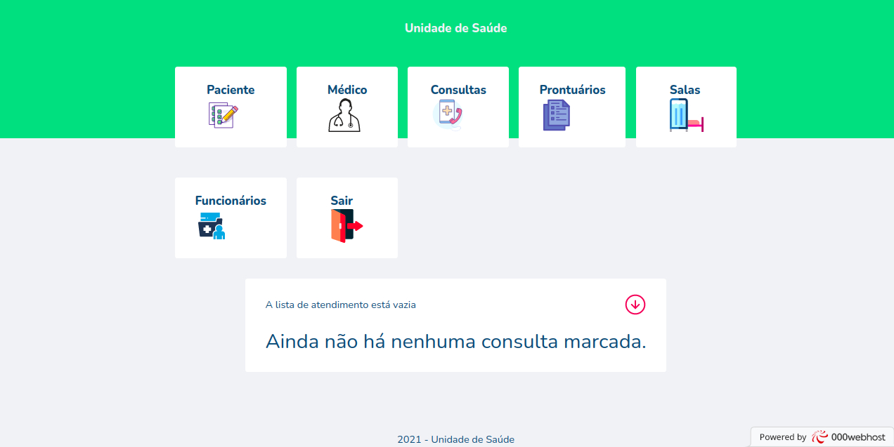

# Health Unit

  

Aplicação Web para o auxílio à unidades de saúde com o gerenciamento de consultas e prontuários médicos. [Acessar App Web](https://health-unit.000webhostapp.com/)

## Como executar

- Clone o repositório
- Crie um banco de dados com o script SQL que está em `src/data/database/health_unit.sql`
- Inicie o seu servidor

Agora você pode acessar http://localhost/health-unit/ do seu navegador.

## Observações

Para entrar na plataforma é preciso estar cadastrado como funcionário da Unidade de Saúde.
